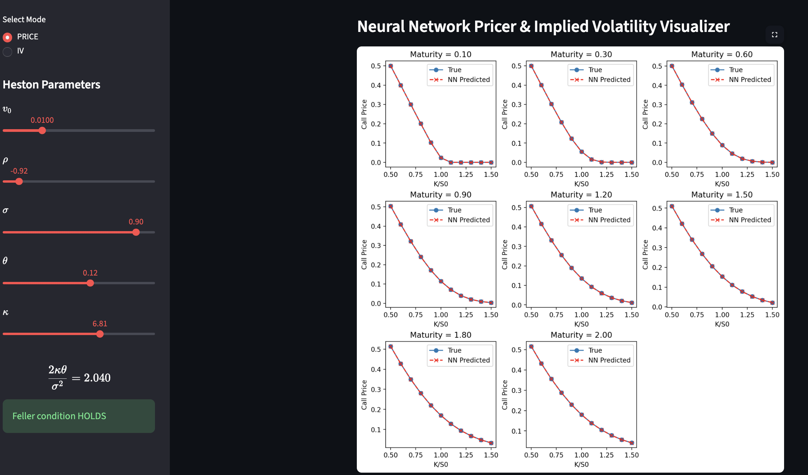

# Deep Heston: Neural-Network Pricing & Calibration

A **deep-learning surrogate** for the Heston stochastic volatility model. A neural network is trained to map Heston parameters directly to an entire option-price / implied-volatility surface — replacing slow numerical pricing with near-instant inference, and enabling fast model calibration.

> **Reference:** Liu, S., Oosterlee, C. W. & Bohte, S. M. (2019). *A Deep Neural Network Perspective on Pricing and Calibration in (Rough) Volatility Models.* [SSRN:3322085](https://papers.ssrn.com/sol3/papers.cfm?abstract_id=3322085)

**🔗 Live demo:** [deep-heston.streamlit.app](https://deep-heston.streamlit.app/)

 -->

## Motivation

Pricing a Heston option requires evaluating a Fourier integral (or running Monte Carlo) for *every* strike and maturity. **Calibration** — finding the parameters that best match a market surface — calls that pricer thousands of times inside an optimizer, which is slow.

The fix, following the "deep pricing" literature, is a two-stage approach:

1. **Offline (train once):** generate a large dataset of `(Heston parameters → price/IV surface)` pairs using a classical pricer, then train a neural network to reproduce the mapping.
2. **Online (use forever):** the trained network prices a full surface in a single forward pass (microseconds), and because the network is differentiable, calibration becomes a fast gradient-based inversion.